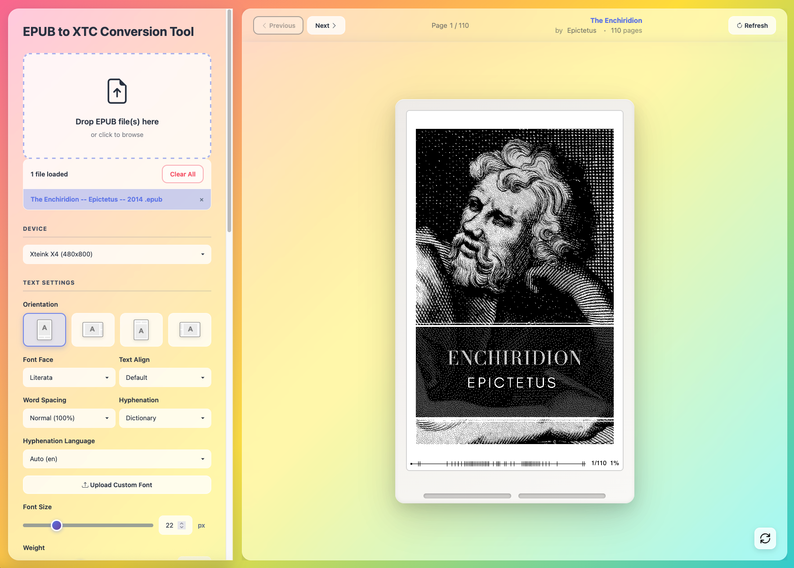
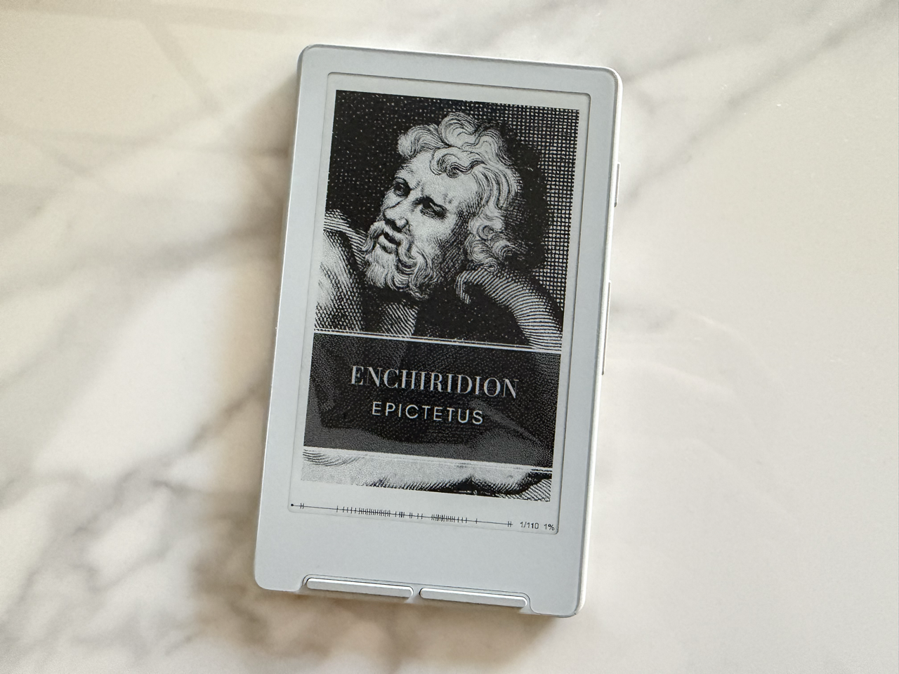

# EPUB to XTC Converter 🔄

A web application for converting EPUB files to [XTC/XTH format](https://gist.github.com/CrazyCoder/b125f26d6987c0620058249f59f1327d) optimized for XTEInk E-reader devices. 

Uses the [CoolReader](https://github.com/buggins/coolreader) rendering engine to deliver high-quality, well-performing device-ready eBooks.

## 🚀 [**Try the Live Demo**](https://alf-arv.github.io/epub-to-xtc-util/?demo=true) (with a book pre-loaded!)

### 💻 Screenshot

### 🌎 End-result

---

### 📱 Device Support
- **[XTEInk X4](https://www.xteink.com/products/xteink-x4)**
- **[XTEInk X3](https://www.xteink.com/products/xteink-x3)**
- Full orientation support (0°, 90°, 180°, 270°)

### ⚡ Advanced Text Rendering
- **Professional Typography**: Powered by CoolReader's crengine for advanced text layouts
- **Multi-language Support**: Support for multiple hyphenation dictionaries for languages such as English, German, French, Polish, and Russian among others
- **Font Management**: 
  - 10+ curated Google Fonts optimized for e-ink reading
  - Custom font upload support
  - Variable font support with full weight ranges
- **Text Controls**:
  - Adjustable font size, line spacing, and margins
  - Configurable word spacing (50% - 200%)
  - Multiple text alignment modes (left, right, center, justify)
  - Dictionary-based and algorithmic hyphenation

### 🛠️ Features
- **Image Grayscale Dithering**: Conversion to achieve easy-to-render grayscale images on weak hardware
- **Quality Modes**:
  - **Fast Mode**: 1-bit dithering for smaller file sizes (XTG/XTC formats)
  - **High Quality Mode**: 2-bit grayscale (in XTH format)
- **Other advanced customization**:
  - Adjustable dither strength (0-100%)
  - Image negative mode
  - Custom bit depth control
- **Progress Bar Rendering**:
  - Customizable progress bar (with multiple positions)
  - Chapter markers, navigation and book completion percentage
  - Page and chapter progress indicators
- **Table of Contents**: Interactive chapter navigation with nested hierarchy support
- **Live Preview**: Real-time rendering preview with device frame simulation
- **Batch Processing**
  - Multiple file upload and conversion
  - Batch export capabilities
  - Individual page export (XTG/XTH single-page format)

---

## ❤️ Credits & Acknowledgments

Let us gratefully acknowledge the following projects and resources used in this project:

- **[x4Converter.rho.sh](https://x4converter.rho.sh/)** - Main website inspiration

- **[The CoolReader engine](https://github.com/buggins/coolreader)** — Responsible for document rendering, parsing and layout ([GPL v2 license](https://github.com/buggins/coolreader/blob/master/LICENSE))

- **[Alice's Adventures in Wonderland](https://www.gutenberg.org/ebooks/11)** by Lewis Carroll — Demo book from Project Gutenberg (Public Domain)

- **[Floyd-Steinberg Dithering](https://en.wikipedia.org/wiki/Floyd%E2%80%93Steinberg_dithering)** — Industry-standard error diffusion algorithm (1976)
  - Optimal grayscale conversion for limited color palettes (adapted for e-ink display characteristics)
  - Reference: Floyd, R.W.; Steinberg, L. (1976). "An adaptive algorithm for spatial grey scale"

- **[Google Fonts](https://fonts.google.com/)** — High-quality, open source typefaces ([SIL Open Font License](https://scripts.sil.org/OFL))

- **[Bootstrap 5.3](https://getbootstrap.com/)** — Modern, responsive UI framework ([MIT License](https://github.com/twbs/bootstrap/blob/main/LICENSE))
  
- **[Bootstrap Icons](https://icons.getbootstrap.com/)** — Comprehensive icon library ([MIT License](https://github.com/twbs/bootstrap/blob/main/LICENSE))

- **[jsDelivr](https://www.jsdelivr.com/)** — Free, fast, and reliable CDN (used for fonts)

---

## 📄 License

This project is licensed under the GNU General Public License v2.0 (GPL-2.0). Feel free to take inspiration from, modify or improve this small project to your liking for personal use without notice to me, but adhere to the GPL-2.0 license for any redistributions based on this. Please refer to individual component licenses for specific terms. 

Built with ❤️ for the e-ink reading community
